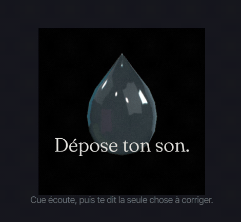
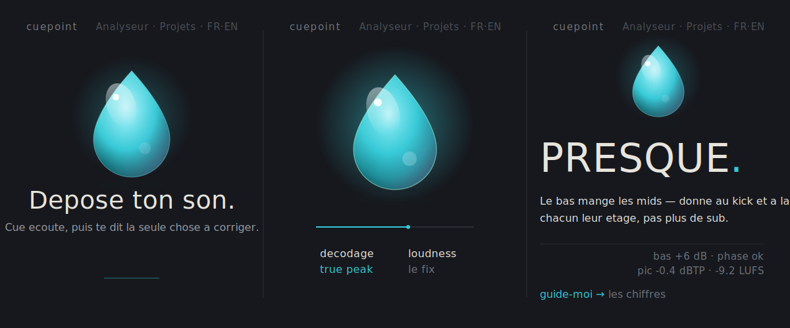
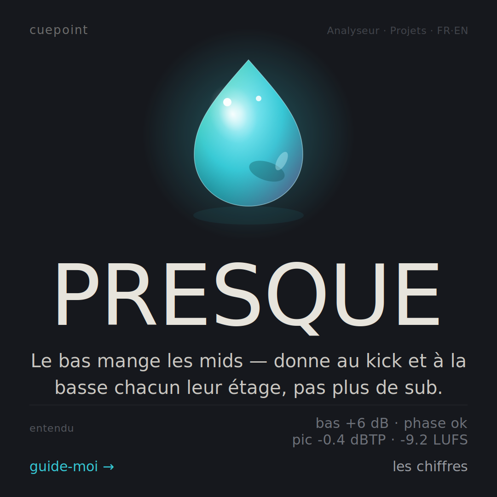

<h1 align="center">CuePoint — drop the track, get one honest fix.</h1>

<p align="center">
  <b>A real in-browser DSP listens to your bounce — LUFS, true peak, phase, spectrum — and Cue gives you the single priority fix in plain producer French, then walks you to the plugin chain.</b><br>
  No bluffing, no upload: the audio never leaves your browser.
</p>

<p align="center">
  
  
  
  
  
  
  
  
</p>

<p align="center">
  <a href="https://cuepoint-mu.vercel.app"><b>→ Open the live app</b></a> ·
  <a href="https://github.com/arochab/cuepoint">Source</a>
</p>

<p align="center">
  
</p>

<p align="center">
  
</p>

Every producer knows the moment: the track is *almost* there, something is off, and you don't know what. So you open ten tabs, push faders at random, and lose the thread. CuePoint refuses to add to that noise. You drop a track, a real DSP runs entirely in your browser — BS.1770-4 integrated LUFS, a 4×-oversampled true peak, phase correlation, a full FFT spectrum and its tilt — and Cue tells you the **one** thing to fix first, in the voice of a producer who's been there, then hands you the exact plugin chain. The hard truth baked into the whole thing: **Cue never bluffs.** The engine genuinely hears five things, those map to five producer needs, and a recipe is only ever offered when the measurement actually supports it — the routing is structural, not a vibe. Under the verdict sits an "honesty receipt" that shows you the raw numbers Cue heard. And because all the DSP is client-side (`OfflineAudioContext`), your unreleased music never touches a server. Free. French by default — it's built for a French producer first — with an EN toggle.

---

## What you get

<table>
<tr>
<td width="50%" valign="top">

- **One fix, not a dashboard** — the verdict screen is subtracted to a single spoken sentence (Fraunces serif) and *the* priority move. The mix score, the stat tiles and the raw evidence are folded into one quiet "more" — there when you want them, silent when you don't.
- **A DSP that actually listens** — real radix-2 FFT, ITU-R BS.1770-4 K-weighting with two-stage gating for integrated LUFS, 4×-oversampled Lanczos true peak (dBTP), whole-file phase correlation, 1/3-octave spectrum and a regression-fit spectral tilt. No Web Audio AnalyserNode shortcuts — the math is in the repo.
- **The honesty engine** — the DSP hears 5 things → 5 producer needs (low-end clash, phase/mono collapse, harsh top, loudness/headroom, "is it ready?"). Recipes route deterministically off an explicit `recipe.need` field, so Cue can't hand you a fix the measurement doesn't justify.

</td>
<td width="50%" valign="top">

- **A living, audio-reactive droplet** — "Cue" is a real Three.js liquid-glass object: a custom vertex-displacement shader makes the surface breathe. While Cue is listening, it pulses to the real DSP stage progress; on the verdict reveal it plays back your track's *real* RMS envelope once (never `Math.random()`). It shifts colour with the verdict (cyan = one fix, lime = ship it, magenta = needs work).
- **Honest progress** — a 4-stage stepper (decode → loudness → true peak → spectrum) that ticks as each real DSP phase begins. The bar reaches 100% only when the result is actually ready — the faked 95%-then-snap timer was deleted on purpose.
- **Your audio stays yours** — 100% client-side DSP via `OfflineAudioContext`; nothing is uploaded. Optional Supabase sign-in (Google or email link) only saves your *track memory* — the derived numbers, never your audio. The whole product works signed-out.

</td>
</tr>
</table>

<p align="center">
  
</p>

## How it works

Drop a file → a real DSP pass → one need → one fix, all in the browser:

```
  your .wav/.mp3  ──►  OfflineAudioContext (decode)
        │
        ▼  src/lib/utils/audio.ts  (all client-side, no upload)
  ┌─────────────────────────────────────────────────────────┐
  │ LUFS (BS.1770-4, K-weight + gating) · true peak (4× OS)  │
  │ phase correlation · 1/3-oct FFT spectrum · spectral tilt │
  │ + a real RMS envelope (plays back on the verdict reveal) │
  └─────────────────────────────────────────────────────────┘
        │  metrics → issues (score.ts / detectIssues)
        ▼
   ONE priority need  ──►  needRoutes.ts  ──►  the matching plugin-chain recipe
   (low-end · phase · top-end · loudness · ready?)     (deterministic, no bluff)
```

1. **The browser is the only machine.** `analyzeAudio()` decodes into an `OfflineAudioContext` and runs the full DSP locally — a yielding stage callback feeds the honest 4-step progress bar.
2. **Metrics become needs, not guesses.** Raw numbers are interpreted (genre-aware) into a verdict and a single priority issue; the "honesty receipt" surfaces the actual measurements under the verdict word.
3. **Needs route to recipes structurally.** Each of the 20 recipes carries an explicit `need`; `suggestionsForIssues()` only returns routes the DSP can support — replacing the old brittle tag-overlap scoring. Each recipe is a real chain (e.g. Pro-Q 3 → Pro-C 2 → Devastor 2 → Pro-L 2) with an Ableton-native alternative.

Tuned for the music it's for: deep house, minimal, techno, dub techno, electro, acid, UK garage and ambient each carry their own target zones, so "too loud" or "low end's too heavy" means *for this style*.

## Built agentically with Claude Code — the honest version

This product was built with Claude Code using a heavy multi-agent workflow, and that process is the showcase. Told straight, including the part where an agent was wrong:

- **The UX was not vibe-coded — it was put on trial.** I built ruthless multi-agent "juries" (Jobs / Ive / Musk lenses, a mastering engineer, a localization + onboarding expert) to audit the *real running app* and score it against my own work. The verdict wasn't "add features," it was "delete." That forced a deletion-driven redesign: the mix-score hero, the stat tiles, the euro packs, the standalone recipe library and a button-and-div-heavy screen were all removed.
- **A creator → tester → hard-judge loop chose the design.** One workflow generated **4 radical zero-card directions**, stress-tested each, and a hard judge picked the winner — **"Silence"**: a dark, breathing, single-column room with zero cards anywhere and one accent colour. It was feasibility-checked against the real source before a line was written.
- **An agent hallucinated — and verification caught it.** One workflow confidently described a scene architecture that *did not exist in the codebase*. It was caught by checking the real file tree against the claim, and its output was discarded. This is the point: agents are used adversarially and verified against the real code, not trusted blindly. That discipline is why the honesty engine, the genuine 4-stage progress and the RMS-reactive droplet are real and not faked.
- **Honesty was enforced as an engineering rule.** A `Math.random()` "live meter" and a fake completion delay were found and deleted; the progress bar now reflects real DSP completion. The no-bluff `recipe.need` routing exists *because* the jury demanded Cue never promise a fix the measurement can't back.

Same body of work as the author's other public repos: [claude-eats-tokens](https://github.com/arochab/claude-eats-tokens), kapman-news, prism, brandpulse-app.

## Design — "Silence"

Not a theme on top of an app; the app *is* the design.

- **One room, zero cards.** A dark single-column space — Slate `#16181D` ground, Mist `#E7E4DC` text — with one accent: Tide cyan `#36C9D6`. `radius: 0`, `shadow: 0`, one easing curve. A `Column` primitive plus a `:where(...)` reset in `app.css` strips background, border, shadow, radius and padding off every legacy card class — so the old card styling can't creep back in.
- **Type as voice.** Fraunces serif speaks (verdicts, invitations); Inter Tight handles the UI; JetBrains Mono is reserved strictly for plugin/param strings. Colour lives in exactly one place — the droplet — so a verdict hue actually *means* something.
- **Real motion, honestly sourced.** The droplet uses a GLSL simplex-noise vertex displacement + a Fresnel rim glow and `EffectComposer` bloom; on the verdict reveal its pulse is your track's RMS envelope, decayed to zero when idle. `prefers-reduced-motion` skips WebGL entirely for a static, on-brand fallback.

## Tech stack

- **Svelte 5** — runes (`$state` / `$derived` / `$effect`); module state in `.svelte.ts` files, exported `$state` mutated in place (never reassigned).
- **Vite 6** + **Tailwind CSS v4** — theme lives in `src/app.css @theme`; no `tailwind.config.js`, the Tailwind Vite plugin runs before Svelte.
- **TypeScript 5** — strict, `moduleResolution: bundler`.
- **Three.js** — custom shader injection via `onBeforeCompile`, lazy-loaded and code-split into its own chunk (~952 KB) so the first paint stays light (the index chunk is ~342 KB).
- **Supabase** — `@supabase/supabase-js` v2, Google OAuth + email-link auth, RLS-gated track memory. Publishable key only ever ships to the browser.
- **Vercel** — static SPA build (`dist/`), SPA rewrite + immutable `/assets` caching in `vercel.json`.
- **i18n** — bilingual FR / EN, FR by default (a deliberate choice — built for a French producer first).

## Run it locally

```bash
git clone https://github.com/arochab/cuepoint.git
cd cuepoint

npm install

# Supabase is optional — the analyzer works fully signed-out.
# Fill these in only if you want Google / email-link auth + saved track memory.
cp .env.example .env
#   VITE_SUPABASE_URL=https://your-project.supabase.co
#   VITE_SUPABASE_KEY=sb_publishable_xxxxxxxx   (legacy VITE_SUPABASE_ANON_KEY also works)

npm run dev        # → http://localhost:5173
npm run build      # → dist/  (Vercel: framework "vite", output "dist")
npm run check      # svelte-check (TypeScript)
```

The DSP, the droplet and the verdict all work with no `.env` at all — Supabase only adds saved track memory.

## Repo map

```
index.html                      Vite entry · Fraunces / Inter Tight / JetBrains Mono
src/App.svelte                  in-memory router (Home · Analyzer · Projects · RecipeDetail · Auth · Admin)
src/lib/utils/audio.ts          the DSP — FFT, BS.1770-4 LUFS, 4× true peak, spectrum, envelope
src/lib/reco/score.ts           metrics → verdict + genre-aware band reads
src/lib/reco/needRoutes.ts      deterministic need → recipe routing (the anti-bluff layer)
src/lib/reco/issueText.ts       producer-voice FR/EN verdict copy + honesty receipt
src/lib/data/recipes.ts         20 plugin-chain recipes (+ Ableton-native alternatives)
src/lib/cue/cueScene.ts         the Three.js liquid-glass droplet (real shader + RMS reactivity)
src/lib/components/             Home · AudioAnalyzer · Cue · Column · Projects · Nav · Auth …
src/lib/i18n/index.svelte.ts    FR-default bilingual dictionary (runes module state)
src/lib/supabase/client.ts      public Supabase client (RLS-gated)
vercel.json                     SPA rewrite + immutable asset caching
```

## License

[MIT](LICENSE) · Built by [Adam Chabbi](https://github.com/arochab).
